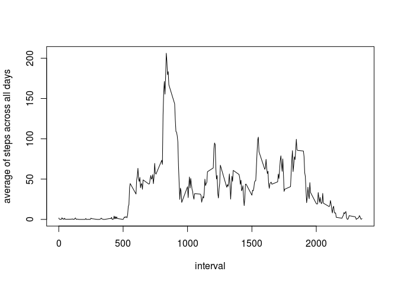

# Reproducible Research: Peer Assessment 1


## Loading and preprocessing the data
Loading the data from activity.csv

```r
activity = read.csv("activity.csv")
```

Removing all NA entries from steps column

```r
activityWithoutNA = activity[!is.na(activity$steps), ]
```


## What is mean total number of steps taken per day?

Calculating the total number of steps taken each day

```r
aggregatedStepsByDate = aggregate(steps ~ date, activityWithoutNA, sum)
```

Histogram with the total steps taken per day

```r
hist(aggregatedStepsByDate$steps,
    main="Histogram",
    border="blue",
    xlab="Steps per day",
    breaks = 50)
```

<!-- -->

The mean and median of the total number of steps taken per day

```r
mean(aggregatedStepsByDate$steps)
```

```
## [1] 10766.19
```

```r
median(aggregatedStepsByDate$steps)
```

```
## [1] 10765
```


## What is the average daily activity pattern?

Calculating the average number of steps taken per interval

```r
aggregatedStepsByInterval = aggregate(steps ~ interval, activityWithoutNA, mean)
```

Plotting the average number of steps across all days per internal

```r
plot(aggregatedStepsByInterval$interval, aggregatedStepsByInterval$steps, type="l", ylab="average of steps across all days", xlab="interval")
```

<!-- -->

The interval 835 contains the maximum number of steps (on average across all the days)

```r
aggregatedStepsByInterval$interval[aggregatedStepsByInterval$steps == max(aggregatedStepsByInterval$steps)]
```

```
## [1] 835
```


## Imputing missing values

Calculating the total number of missing values in the dataset

```r
isNA = is.na(activity)
length(isNA[isNA == TRUE])
```

```
## [1] 2304
```

That's also the number of missing values in the steps column, so that is only an issue on steps column

```r
stepsNA = is.na(activity$steps)
length(stepsNA[stepsNA == TRUE])
```

```
## [1] 2304
```

The average of steps across all days will be used (previously calculated) will be used to fill the NA step values, according to its 5-minute interval.

Creating a new dataset with the original data

```r
newActivity = activity
```

The array stepsNA already indicates which rows of the steps column are NA

```r
for (i in c(1: length(stepsNA))) {
    if (stepsNA[i]) {
        index = aggregatedStepsByInterval$interval == newActivity$interval[i]
        newActivity$steps[i] = aggregatedStepsByInterval$steps[index]
    }
}
```

Just to make sure that newActivityStepsNA does not have NA values on steps column

```r
newActivityStepsNA = is.na(newActivity$steps)
length(newActivityStepsNA[newActivityStepsNA == TRUE])
```

```
## [1] 0
```


Calculating the total number of steps taken each day

```r
aggregatedStepsByDate = aggregate(steps ~ date, newActivity, sum)
```

Histogram with the total steps taken per day

```r
hist(aggregatedStepsByDate$steps,
    main="Histogram",
    border="blue",
    xlab="Steps per day",
    breaks = 50)
```

<!-- -->

The mean and median of the total number of steps taken per day

```r
mean(aggregatedStepsByDate$steps)
```

```
## [1] 10766.19
```

```r
median(aggregatedStepsByDate$steps)
```

```
## [1] 10766.19
```

As it's possible to see, only the median change when comparing with the initial analyzes without the NA step values. It was 10765 and now is 10766.19, which, by the way, is also the mean value for it. 

## Are there differences in activity patterns between weekdays and weekends?

Creating a new column day which contains "Weekday" or "Weekend" according to its date column value

```r
isWeekend <- c(1, length(newActivity$date))
for (i in c(1: length(newActivity$date))) {
    day = weekdays(as.Date(newActivity$date[i]))
    isWeekend[i] = day == "Saturday" | day == "Sunday"
}

newActivity["day"] <- factor(isWeekend, labels=c("Weekday", "Weekend"))
```

Filtering data based on the day column

```r
activityWeekend = newActivity[newActivity$day == "Weekend",]
activityWeekday = newActivity[newActivity$day == "Weekday",]
```

Calculating the average number of steps taken across all weekdays

```r
aggregatedWeekend = aggregate(steps ~ interval, activityWeekend, mean)
aggregatedWeekend["day"] <- "Weekend"
```

Calculating the average number of steps taken across all weekend days

```r
aggregatedWeekdays = aggregate(steps ~ interval, activityWeekday, mean)
aggregatedWeekdays["day"] <- "Weekday"
```

Consolidating data into single finalData variable

```r
finalData = rbind(aggregatedWeekend, aggregatedWeekdays)
```

Loading lattice and plotting the average of steps across all days separated by Weekday and Weekend days

```r
library("lattice")
xyplot(finalData$steps~finalData$interval|finalData$day,
       type="l",
       layout=(c(1,2)),
       ylab="Average of steps across all days",
       xlab="Interval")
```

<!-- -->
